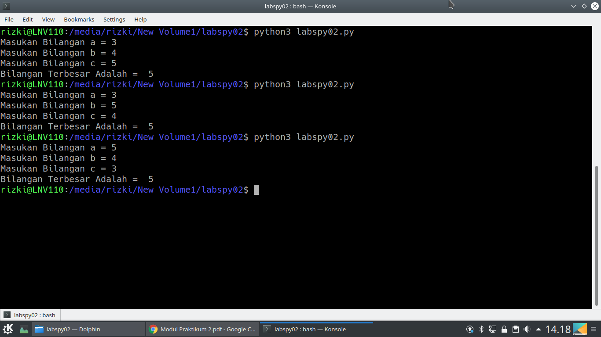
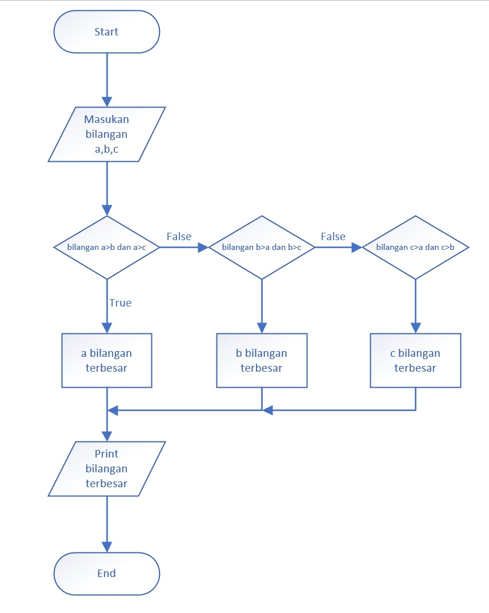

# 
.::Uraian Langkah::. 

1.Masukan nilai a 
2.Masukan nilai b 
3.Masukan nilai c  
4.If 
        <strong>kondisi 1</strong> 
    Jika bilangan "a" lebih besar dari bilangan "b" dan "c",  
    maka bilangan terbesar nya adalah bilangan "a" 
        <strong>kondisi 2</strong> 
    Kecuali, jika bilangan "b" lebih besar dari bilangan "a" dan "c",  
    maka bilangan terbesar nya adalah bilangan "b" 
        <strong>kondisi 3</strong> 
    Kecuali, jika bilangan "c" lebih besar dari bilangan "a" dan "b",  
    maka bilangan terbesar nya adalah bilangan "c"  
5.Maka akan menampilkan bilangan terbesar dari tergantung nila a,b dan c, yang menyesuaikan kondisi statement if  

<strong>Screenshot</strong>

<strong>Flowchart</strong>

:::Rizki Nurdiansyah::: 

:::____311910155____::: 

:::_____TI.19.D.2_____::: 

	
